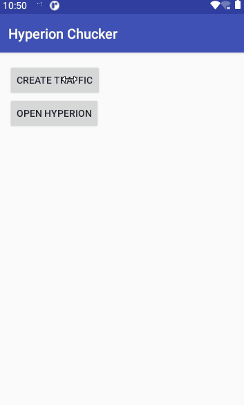

# Hyperion-Chucker
[Hyperion](https://github.com/willowtreeapps/Hyperion-Android) Plugin for forked [Chucker](https://github.com/esabook/chucker)




## Usage
First, follow the README to set up [Chucker](https://github.com/esabook/chucker). Then, follow the README to set up [Hyperion](https://github.com/willowtreeapps/Hyperion-Android). Then, all you need to do is simply add the dependency:

```
allprojects {
	repositories {
		mavenCentral()
	}
}
```

[](https://search.maven.org/artifact/io.github.esabook/hyperion-chucker)
```
dependencies {
    debugImplementation 'io.github.esabook:hyperion-chucker:2.0.1'
}
```

Hyperion will then find the plugin and add it to the list when you open the Hyperion drawer.

## Icon
Generated from [AndroidAssetStudio](http://romannurik.github.io/AndroidAssetStudio/icons-generic.html), with color set to #8e8e93, with asset padding set to 0dp and asset size set to 30dp.

## License
Hyperion-Chuck is available under the MIT license. See the LICENSE file for more info.
